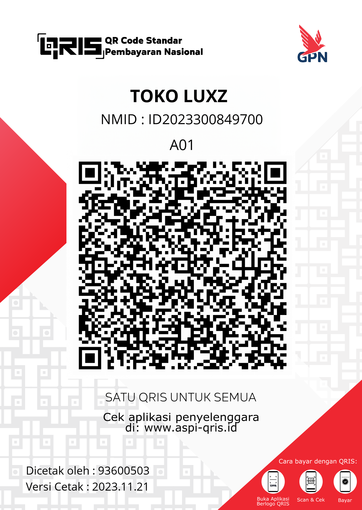

# Dashboard Payment Gateway

Website ini menyediakan **dashboard pembayaran manual** (DANA, Gopay, OVO, QRIS) serta **payment gateway otomatis** terhubung dengan API pihak ketiga dan notifikasi Telegram Bot.

---

## Struktur Folder
```
.
├── index.html
├── donate/
│   └── index.html
├── assets/
│   ├── css/
│   │   └── style.css
│   ├── img/
│   │   └── qris.png
│   └── js/
│       ├── settings.js
│       └── main.js
├── README.md
└── LICENSE
```

---

## Fitur
- Dashboard pembayaran manual
  - DANA, Gopay (nomor tampil dengan klik kartu)
  - OVO (status tidak tersedia)
  - QRIS (tampilkan gambar QR, zoom, dan download)
- Payment Gateway Otomatis
  - Generate QR pembayaran (kadaluarsa 5 menit)
  - Cek status transaksi setiap detik
  - Kirim notifikasi ke Telegram Bot jika sukses
- UI/UX
  - Tema light neon dark
  - Animasi transisi slide & fade

---

## Konfigurasi
Buka file `assets/js/settings.js` lalu isi variabel berikut:

```javascript
export const TELEGRAM_BOT_TOKEN = "ISI_TOKEN_BOTMU";
export const TELEGRAM_CHAT_ID   = "ISI_ID_OWNERMU";
```

Simpan, lalu jalankan website di browser.

---

## API yang Digunakan

Payment gateway otomatis ini menggunakan **API dari nvidiabotz.xyz**.

### 1. Create Payment
Membuat transaksi baru:

```bash
POST https://api.nvidiabotz.xyz/orderkuota/createpayment?amount={NOMINAL}&codeqr={DATA_QRIS}
```

Contoh respon:

```json
{
  "creator": "FR3HOSTING",
  "status": true,
  "result": {
    "idtransaksi": "FR3DEV-B52D",
    "jumlah": "160000",
    "expired": "2025-07-30T04:00:27.460Z",
    "imageqris": {
      "url": "https://img1.pixhost.to/images/7583/626966319_fr3.png"
    }
  }
}
```

Catatan: `expired` hanya berlaku 5 menit.

---

### 2. Cek Mutasi (Status Transaksi)
Mengecek apakah transfer QRIS sudah masuk:

```bash
GET https://api.nvidiabotz.xyz/orderkuota/mutasiqr?username=USERNAME&token=TOKEN
```

Contoh respon:

```json
{
  "creator": "FR3HOSTING",
  "status": true,
  "result": [
    {
      "id": 163500122,
      "kredit": "5000",
      "keterangan": "NOBU / KH*********",
      "tanggal": "07/08/2025 16:36",
      "status": "IN",
      "brand": {
        "name": "DANA",
        "logo": "https://app.orderkuota.com/assets/qris/dana.png"
      }
    }
  ]
}
```

Sistem akan polling setiap 1 detik sampai status transaksi terdeteksi masuk.

---

## Dukung Developer
Jika project ini bermanfaat, kamu bisa mendukung agar development terus berjalan.  

#### BUAT BELI KOPI🗿

<p align="center">
  
</p>
